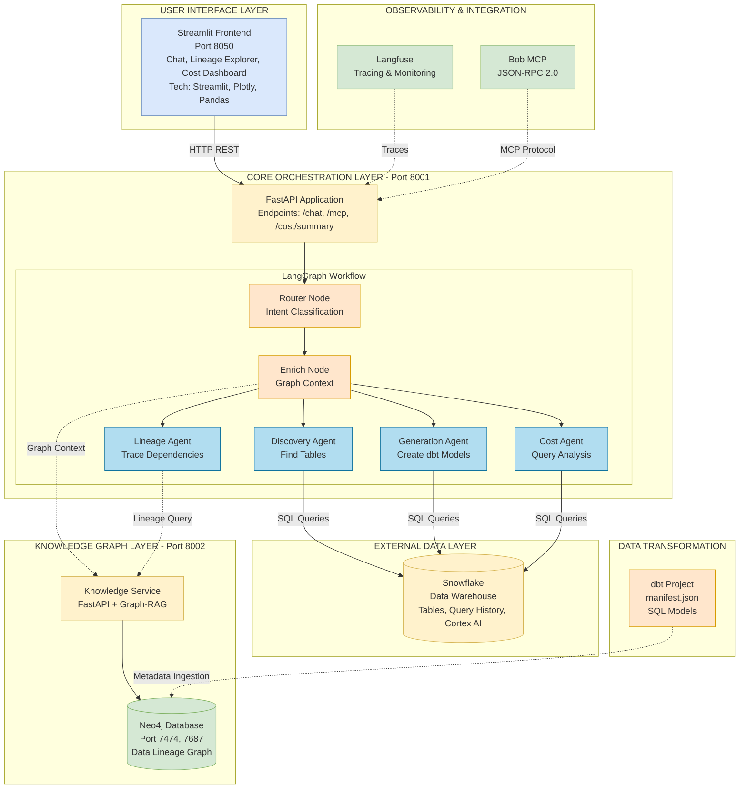

e# DataMind Architecture Diagram

## Main System Architecture



## Architecture Overview

This diagram shows the complete DataMind architecture with the following layers:

### 1. User Interface Layer (Blue)
- **Streamlit Frontend** (Port 8050)
- Provides chat interface, lineage explorer, and cost dashboard
- Technologies: Streamlit, Plotly, Pandas, HTTPX

### 2. Core Orchestration Layer (Yellow/Orange)
- **FastAPI Application** (Port 8001)
- Main endpoints: `/chat`, `/mcp`, `/cost/summary`
- **LangGraph Workflow Engine** with 4 specialized agents:
  - **Router Node**: Classifies user intent (Discovery, Lineage, Generation, Cost)
  - **Enrich Node**: Fetches graph context from Knowledge Service
  - **Discovery Agent**: Finds Snowflake tables/views
  - **Lineage Agent**: Traces data dependencies via Neo4j
  - **Generation Agent**: Creates dbt SQL models using AI
  - **Cost Agent**: Analyzes query costs and provides optimization tips

### 3. Knowledge Graph Layer (Gray/Green)
- **Knowledge Service** (Port 8002)
- FastAPI + Graph-RAG engine
- **Neo4j Database** (Ports 7474, 7687)
- Stores data lineage graph and metadata

### 4. External Data Layer (Yellow)
- **Snowflake Data Warehouse**
- Provides tables, query history, and Cortex AI (LLM)
- Used for metadata discovery and AI-powered responses

### 5. Data Transformation (Orange)
- **dbt Project**
- Contains manifest.json with metadata
- SQL transformation models
- Metadata ingested into Neo4j for lineage tracking

### 6. Observability & Integration (Green)
- **Langfuse**: Tracing and monitoring all agent executions
- **Bob MCP**: Model Context Protocol integration for IBM Bob assistant

## Data Flow

### Solid Arrows (→)
- **Blue arrows**: HTTP REST API calls
- **Red arrows**: Snowflake SQL queries
- **Black arrows**: Internal workflow transitions

### Dotted Arrows (-.->)
- **Graph Context**: Knowledge Service provides context to agents
- **Lineage Query**: Agents query Neo4j for lineage information
- **Metadata Ingestion**: dbt metadata loaded into Neo4j
- **Traces**: Langfuse observability tracking
- **MCP Protocol**: Bob assistant integration

## Key Technologies by Component

| Component | Technologies |
|-----------|-------------|
| **Frontend** | Streamlit, Plotly, Pandas, HTTPX |
| **Core Backend** | FastAPI, LangGraph, LangChain, Pydantic, Uvicorn |
| **Knowledge Service** | FastAPI, Neo4j Driver, LangChain-Neo4j |
| **Graph Database** | Neo4j 5.15, APOC |
| **Data Warehouse** | Snowflake, Snowflake Cortex AI, Snowflake Connector |
| **Transformation** | dbt-core, dbt-snowflake |
| **Observability** | Langfuse SDK, @observe decorators |
| **Integration** | MCP Protocol (JSON-RPC 2.0) |

## How to View This Diagram

### Option 1: GitHub/GitLab
- Push this file to your repository
- Mermaid diagrams render automatically in markdown preview

### Option 2: VS Code
1. Install extension: "Markdown Preview Mermaid Support"
2. Open this file
3. Press `Ctrl+Shift+V` (Windows/Linux) or `Cmd+Shift+V` (Mac)
4. Diagram renders in preview pane

### Option 3: Mermaid Live Editor
1. Go to https://mermaid.live/
2. Copy the code between the \`\`\`mermaid tags
3. Paste into the editor
4. Edit and export as PNG/SVG/PDF

### Option 4: Documentation Platforms
- Most modern documentation tools support Mermaid
- Docusaurus, MkDocs, GitBook, Confluence, Notion

## Service Ports Reference

| Service | Port | Purpose |
|---------|------|---------|
| Streamlit Frontend | 8050 | User interface |
| Core Service | 8001 | Main API and MCP endpoint |
| Knowledge Service | 8002 | Graph-RAG and lineage |
| Neo4j Browser | 7474 | Graph database UI |
| Neo4j Bolt | 7687 | Graph database protocol |

## Quick Start

```bash
# Start all services with Docker Compose
docker-compose up -d

# Access the application
# Frontend: http://localhost:8050
# Core API Docs: http://localhost:8001/docs
# Knowledge API Docs: http://localhost:8002/docs
# Neo4j Browser: http://localhost:7474

# View logs
docker-compose logs -f

# Stop all services
docker-compose down
```

## Agent Workflow Examples

### Discovery Flow
```
User: "Find tables related to orders"
  ↓
Router → Intent: DISCOVERY
  ↓
Enrich → Fetch graph context from Neo4j
  ↓
Discovery Agent → Query Snowflake INFORMATION_SCHEMA
  ↓
Cortex AI → Generate natural language response
  ↓
Response: "Found 3 tables: orders, order_items, order_status..."
```

### Lineage Flow
```
User: "Show lineage for fct_orders"
  ↓
Router → Intent: LINEAGE
  ↓
Enrich → Fetch graph context
  ↓
Lineage Agent → Query Neo4j for paths
  ↓
Cortex AI → Explain lineage in plain English
  ↓
Response: "fct_orders depends on stg_orders and stg_customers..."
```

### Generation Flow
```
User: "Generate monthly revenue dbt model"
  ↓
Router → Intent: GENERATION
  ↓
Enrich → Get available tables
  ↓
Generation Agent → Query Snowflake for table list
  ↓
Cortex AI → Generate dbt SQL model
  ↓
Response: SQL code with model name and file path
```

### Cost Flow
```
User: "Which queries cost the most?"
  ↓
Router → Intent: COST
  ↓
Cost Agent → Query ACCOUNT_USAGE.QUERY_HISTORY
  ↓
Cortex AI → Generate optimization recommendations
  ↓
Response: Top expensive queries + optimization tips
```

---

**Document Version**: 1.1  
**Last Updated**: 2026-05-23  
**Status**: ✅ Reviewed and Verified